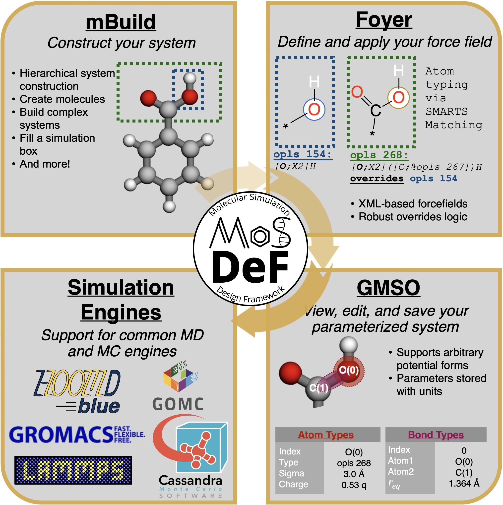

# CECAM-MoSDeF-Workshop
Welcome to the MoSDeF tutorial at the CECAM Flagship Workshop: Proposal FAIR and TRUE Data Processing for Soft Matter Simulations.

## About MoSDeF
The Molecular Simulation Design Framework, or MoSDeF,1 is an collaborative project focus on developing an open-source software suite to assist with the preparation of chemical/biological systems for molecular simulation. The framework strives to create tools that are
- Non-specific
- Force field agnostic
- Engine agnostic

These principals allow for the creation of more diverse workflow, that is, utilizing multiple simulation engines to perform each steps of the simulation process, and simulate systems at multiple scales, e.g, ab initio, atomistic, coarse-grained, and more. Most importantly, the MoSDeF software suite trivialize the distribution of the system's initialization, and parameterization process, ensure their reproducibility by the general community.

## The MoSDeF Workflow: Towards TRUE Simulations
Transparent, Reproducible, Usable by others, and Extensible (TRUE) are four criteria for published computational simulation research introduced by Thompson et al. The TRUE criteria are introduced to encounter the (ir)reproducibility issues in the community, which, in many cases, can be attributed to:
- Human error
- Incomplete reports of simulation workflow
- Unpublished codes

The MoSDeF provides necessary tools to automate the simulation workflow in a scriptable manners, eliminating unnecessary manual interaction with the established workflow, and simplify the distribution of codes utilized for the system initialization process, and assist with the adherence to the TRUE criteria.

## The MoSDeF Tutorial at CECAM

In this tutorial, we will walk through a series of simulation workflows, all using MoSDeF to create the chemical/biological systems, parameterize, and write out to different file formats that can be taken in by various simulation engines.
Through these workflow, we want to demonstrate how our libraries can be used to design TRUE (Transferable, Reproducible, Usable-by-other, and Extensible) studies, and ensure FAIR (Findable, Accesible, Interoperable, and Reusable) data management.

These tutotial workflows are designed to work on Google Colab. User can access these notebooks through the below links:

- [Water Adsorption in Graphene Slitpore](https://colab.research.google.com/github/mosdef-hub/CECAM-MoSDeF-Workshop/blob/main/slitpore_workflow/Slitpore-Workflow.ipynb)

- [Biomolecule](https://colab.research.google.com/github/daico007/CECAM-MoSDeF-Workshop/blob/main/biomolecule_workflow/Biomolecule-Workflow.ipynb)
- [Polymer](https://colab.research.google.com/github/daico007/CECAM-MoSDeF-Workshop/blob/main/polymer_workflow/hoomd-organics.ipynb)
- [Solvated Surface](https://colab.research.google.com/github/daico007/CECAM-MoSDeF-Workshop/blob/main/solvated_surface_workflow/Solvated_Surface.ipynb)
